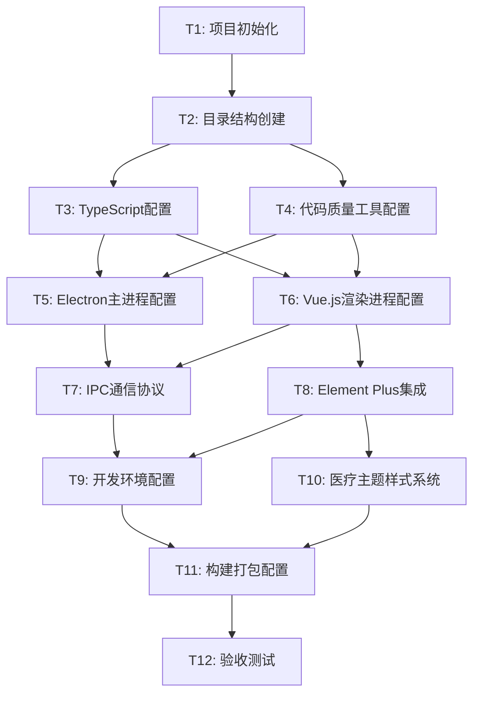

# TASK\_搭建项目开发框架

## 任务概述

基于 CONSENSUS\_搭建项目开发框架.md 的需求，采用小步迭代的方式，将搭建加密视频U盘项目开发框架的工作拆分为多个原子任务。每个任务都具有明确的输入输出契约、实现约束和依赖关系。

## 任务依赖图

## 原子任务详细定义

### T1: 项目初始化

**任务描述**: 创建项目根目录，初始化 package.json，安装核心依赖

状态：已完成

**输入契约**:

- 前置依赖: 无
- 输入数据: 项目名称、版本信息、技术栈要求
- 环境依赖: Node.js >= 16.0.0, npm >= 8.0.0

**输出契约**:

- 输出数据: 项目根目录结构
- 交付物:
  - package.json (包含项目基本信息和核心依赖)
  - .gitignore (忽略规则)
  - README.md (项目说明)
- 验收标准:
  - [ ] package.json 包含正确的项目信息
  - [ ] 核心依赖版本符合兼容性要求
  - [ ] npm install 能成功安装所有依赖

**实现约束**:

- 技术栈: Node.js, npm
- 接口规范: 遵循 npm package.json 标准
- 质量要求: 依赖版本锁定，避免安全漏洞

**依赖关系**:

- 后置任务: T2 (目录结构创建)
- 并行任务: 无

---

### T2: 目录结构创建

**任务描述**: 创建符合三层架构的完整目录结构

状态：✅ 已完成

**输入契约**:

- 前置依赖: T1 (项目初始化)
- 输入数据: 架构设计规范
- 环境依赖: 文件系统访问权限

**输出契约**:

- 输出数据: 完整的目录树结构
- 交付物:
  - src/ 源码目录 (main/, renderer/, shared/)
  - build/ 构建配置目录
  - resources/ 资源文件目录
  - docs/ 文档目录
- 验收标准:
  - [ ] 目录结构符合三层架构设计
  - [ ] 每个目录都有对应的 README.md 说明
  - [ ] 目录命名符合 kebab-case 规范

**实现约束**:

- 技术栈: 文件系统操作
- 接口规范: 遵循项目架构设计原则
- 质量要求: 高内聚低耦合的模块划分

**依赖关系**:

- 后置任务: T3 (TypeScript配置), T4 (代码质量工具配置)
- 并行任务: 无

---

### T3: TypeScript配置

状态：✅ 已完成

**任务描述**: 配置 TypeScript 编译器和类型检查

**输入契约**:

- 前置依赖: T2 (目录结构创建)
- 输入数据: TypeScript 版本要求 (^5.0.0)
- 环境依赖: TypeScript 编译器

**输出契约**:

- 输出数据: TypeScript 配置文件
- 交付物:
  - tsconfig.json (主配置)
  - tsconfig.main.json (主进程配置)
  - tsconfig.renderer.json (渲染进程配置)
- 验收标准:
  - [ ] TypeScript 编译无错误
  - [ ] 类型检查覆盖所有源码目录
  - [ ] 支持最新 ES 特性和装饰器

**实现约束**:

- 技术栈: TypeScript ^5.0.0
- 接口规范: 严格类型检查模式
- 质量要求: 零类型错误容忍

**依赖关系**:

- 后置任务: T5 (Electron主进程配置), T6 (Vue.js渲染进程配置)
- 并行任务: T4 (代码质量工具配置)

---

### T4: 代码质量工具配置

**任务描述**: 配置 ESLint, Prettier, Husky 等代码质量工具

状态：✅ 已完成

**输入契约**:

- 前置依赖: T2 (目录结构创建)
- 输入数据: 代码规范要求
- 环境依赖: Git 仓库

**输出契约**:

- 输出数据: 代码质量配置文件
- 交付物:
  - .eslintrc.js (ESLint 规则)
  - .prettierrc (Prettier 配置)
  - .husky/ (Git 钩子)
  - .lintstagedrc (暂存区检查)
- 验收标准:
  - [ ] ESLint 检查无错误和警告
  - [ ] Prettier 格式化规则生效
  - [ ] Git 提交钩子正常工作

**实现约束**:

- 技术栈: ESLint, Prettier, Husky, lint-staged
- 接口规范: 遵循 Airbnb 代码规范
- 质量要求: 自动化代码质量检查

**依赖关系**:

- 后置任务: T5 (Electron主进程配置), T6 (Vue.js渲染进程配置)
- 并行任务: T3 (TypeScript配置)

---

### T5: Electron主进程配置

**任务描述**: 配置 Electron 主进程，包括窗口管理和安全设置

**输入契约**:

- 前置依赖: T3 (TypeScript配置), T4 (代码质量工具配置)
- 输入数据: Electron 版本要求 (22.3.27)
- 环境依赖: Electron 运行时

**输出契约**:

- 输出数据: 主进程源码文件
- 交付物:
  - src/main/index.ts (主进程入口) ✅
  - src/main/window-manager.ts (窗口管理) ✅
  - src/main/security.ts (安全配置) ✅
  - src/main/utils/ (主进程工具) ✅
- 验收标准:
  - [x] Electron 应用能正常启动和关闭 ✅
  - [x] 安全配置符合最佳实践 ✅
  - [x] 窗口管理功能正常 ✅

**实现约束**:

- 技术栈: Electron 22.3.27, TypeScript
- 接口规范: Electron 安全最佳实践
- 质量要求: 启用上下文隔离和沙箱模式

**依赖关系**:

- 后置任务: T7 (IPC通信协议), T9 (开发环境配置)
- 并行任务: T6 (Vue.js渲染进程配置)

**完成时间**: 2025-01-14
**验收文档**: ai/docs/搭建项目开发框架/原子任务/Electron主进程配置/ACCEPTANCE_Electron主进程配置.md

---

### T6: Vue.js渲染进程配置

**任务描述**: 配置 Vue.js 3 渲染进程，集成 Vite, Pinia, Vue Router

**输入契约**:

- 前置依赖: T3 (TypeScript配置), T4 (代码质量工具配置)
- 输入数据: Vue.js 版本要求 (^3.3.0)
- 环境依赖: Vite 构建工具

**输出契约**:

- 输出数据: 渲染进程源码文件
- 交付物:
  - src/renderer/main.ts (渲染进程入口)
  - src/renderer/App.vue (根组件)
  - src/renderer/router/ (路由配置)
  - src/renderer/stores/ (Pinia 状态管理)
  - vite.config.ts (Vite 配置)
- 验收标准:
  - [ ] Vue.js 组件能正常渲染
  - [ ] Pinia 状态管理正常工作
  - [ ] Vue Router 路由跳转正常

**实现约束**:

- 技术栈: Vue.js ^3.3.0, Vite, Pinia, Vue Router
- 接口规范: Composition API 优先
- 质量要求: 组件化开发，响应式设计

**依赖关系**:

- 后置任务: T7 (IPC通信协议), T8 (Element Plus集成)
- 并行任务: T5 (Electron主进程配置)

---

### T7: IPC通信协议

**任务描述**: 实现主进程和渲染进程间的 IPC 通信协议

**输入契约**:

- 前置依赖: T5 (Electron主进程配置), T6 (Vue.js渲染进程配置)
- 输入数据: 通信接口定义
- 环境依赖: Electron IPC 机制

**输出契约**:

- 输出数据: IPC 通信模块
- 交付物:
  - src/shared/ipc/ (IPC 协议定义)
  - src/main/ipc-handlers.ts (主进程处理器)
  - src/renderer/ipc-client.ts (渲染进程客户端)
- 验收标准:
  - [ ] 主进程和渲染进程能正常通信
  - [ ] 通信协议类型安全
  - [ ] 错误处理机制完善

**实现约束**:

- 技术栈: Electron IPC, TypeScript
- 接口规范: 类型安全的通信协议
- 质量要求: 异步通信，错误处理

**依赖关系**:

- 后置任务: T9 (开发环境配置)
- 并行任务: T8 (Element Plus集成)

---

### T8: Element Plus集成

**任务描述**: 集成 Element Plus UI 组件库，配置基础组件

**输入契约**:

- 前置依赖: T6 (Vue.js渲染进程配置)
- 输入数据: Element Plus 版本要求
- 环境依赖: Vue.js 3 环境

**输出契约**:

- 输出数据: UI 组件库配置
- 交付物:
  - src/renderer/plugins/element-plus.ts (组件库配置)
  - src/renderer/components/ (通用组件)
  - src/renderer/views/ (页面组件)
- 验收标准:
  - [ ] Element Plus 组件能正常使用
  - [ ] 组件按需加载配置正确
  - [ ] 基础页面布局正常显示

**实现约束**:

- 技术栈: Element Plus, Vue.js 3
- 接口规范: 按需加载，树摇优化
- 质量要求: 组件复用，性能优化

**依赖关系**:

- 后置任务: T9 (开发环境配置), T10 (医疗主题样式系统)
- 并行任务: T7 (IPC通信协议)

---

### T9: 开发环境配置

**任务描述**: 配置热重载开发服务器和开发工具

**输入契约**:

- 前置依赖: T7 (IPC通信协议), T8 (Element Plus集成)
- 输入数据: 开发环境要求
- 环境依赖: Vite 开发服务器

**输出契约**:

- 输出数据: 开发环境配置
- 交付物:
  - scripts/dev.js (开发启动脚本)
  - .vscode/settings.json (VS Code 工作区设置)
  - .vscode/extensions.json (推荐扩展列表)
  - .vscode/launch.json (调试配置)
  - electron-builder.json (打包配置基础)
- 验收标准:
  - [ ] npm run dev 能正常启动开发服务器
  - [ ] 主进程和渲染进程热重载正常工作
  - [ ] VS Code 自动安装推荐扩展
  - [ ] VS Code 调试配置能正常启动和断点调试
  - [ ] ESLint 和 Prettier 在 VS Code 中正常工作

**实现约束**:

- 技术栈: Vite, Electron, concurrently
- 接口规范: 开发生产环境分离
- 质量要求: 快速热重载，开发体验优化

**依赖关系**:

- 后置任务: T11 (构建打包配置)
- 并行任务: T10 (医疗主题样式系统)

---

### T10: 医疗主题样式系统

**任务描述**: 实现医疗风格的老年友好主题样式系统

**输入契约**:

- 前置依赖: T8 (Element Plus集成)
- 输入数据: 医疗主题设计规范
- 环境依赖: CSS 预处理器

**输出契约**:

- 输出数据: 主题样式文件
- 交付物:
  - src/renderer/styles/theme/ (主题变量)
  - src/renderer/styles/components/ (组件样式)
  - src/renderer/styles/global.scss (全局样式)
- 验收标准:
  - [ ] 医疗蓝主题色彩正确应用
  - [ ] 字体大小符合老年友好标准
  - [ ] Element Plus 组件样式定制生效
  - [ ] 响应式布局在不同分辨率下正常

**实现约束**:

- 技术栈: SCSS, CSS 变量
- 接口规范: BEM 命名规范
- 质量要求: 无障碍设计，老年友好

**依赖关系**:

- 后置任务: T11 (构建打包配置)
- 并行任务: T9 (开发环境配置)

---

### T11: 构建打包配置

**任务描述**: 配置生产环境构建和 Electron 应用打包

**输入契约**:

- 前置依赖: T9 (开发环境配置), T10 (医疗主题样式系统)
- 输入数据: 目标平台要求 (Windows 7/10/11)
- 环境依赖: electron-builder

**输出契约**:

- 输出数据: 构建配置文件
- 交付物:
  - electron-builder.json (完整打包配置)
  - scripts/build.js (构建脚本)
  - scripts/dist.js (分发脚本)
- 验收标准:
  - [ ] npm run build 能成功构建
  - [ ] 构建产物在 Windows 7/10/11 上正常运行
  - [ ] 应用体积控制在 150MB 以内 (安装包)
  - [ ] 冷启动时间不超过 3 秒

**实现约束**:

- 技术栈: electron-builder, Vite
- 质量要求: 优化构建体积，提升性能，确保向后兼容性
- 兼容性要求: 使用 Electron 22.x (支持 Windows 7)，避免使用 Windows 8+ 专有 API

**依赖关系**:

- 后置任务: T12 (验收测试)
- 并行任务: 无

---

### T12: 验收测试

**任务描述**: 执行完整的验收测试，确保所有功能正常

**输入契约**:

- 前置依赖: T11 (构建打包配置)
- 输入数据: 验收标准清单
- 环境依赖: 测试环境 (Windows 7/10/11)

**输出契约**:

- 输出数据: 测试报告
- 交付物:
  - docs/验收测试报告.md
  - docs/部署指南.md
  - docs/开发指南.md
- 验收标准:
  - [ ] 所有验收标准项目通过 (100% 通过率)
  - [ ] 在 Windows 7/10/11 三个版本测试通过
  - [ ] 应用冷启动时间 ≤ 3 秒
  - [ ] 应用热启动时间 ≤ 1 秒
  - [ ] 内存占用 ≤ 200MB (空闲状态)
  - [ ] CPU 占用 ≤ 5% (空闲状态)
  - [ ] 安装包体积 ≤ 150MB
  - [ ] 文档完整准确，包含部署和开发指南

**实现约束**:

- 技术栈: 手动测试，自动化检查
- 接口规范: 完整的测试覆盖
- 质量要求: 零缺陷交付

**依赖关系**:

- 后置任务: 无 (项目完成)
- 并行任务: 无

## 执行建议

1. **严格按依赖顺序执行**: 确保前置任务完成后再开始后续任务
2. **并行任务优化**: T3 和 T4 可并行执行，T5 和 T6 可并行执行
3. **关键检查点**: T7 (IPC通信) 是关键集成点，需重点验证
4. **质量把控**: 每个任务完成后立即执行验收标准检查
5. **文档同步**: 代码变更同时更新相关文档
6. **异常处理**: 遇到阻塞问题及时记录并寻求人工干预
