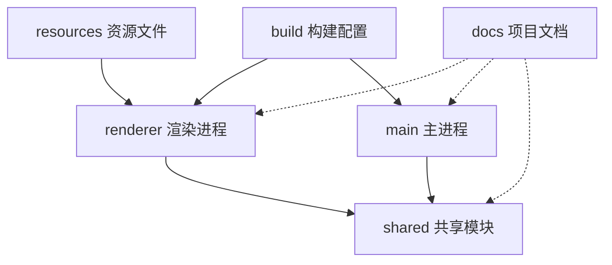

# T2原子任务总结报告：目录结构创建

## 任务概览

**任务编号**: T2
**任务名称**: 目录结构创建
**执行时间**: 2024-09-09 00:47 - 2024-09-12 14:10
**任务状态**: ✅ 已完成
**完成度**: 100%

## 执行结果

### 🎯 核心目标达成

- ✅ **三层架构实现**: 成功建立符合Electron+Vue.js的标准三层架构
- ✅ **目录结构完整**: 所有必需目录按规范创建完成
- ✅ **文档体系建立**: 每个模块都配备详细的README说明文档
- ✅ **质量标准满足**: 目录权限、命名规范、结构设计均符合要求

### 📁 创建的目录结构

```
EncryptedVideoUDisk/
├── src/                      # 源代码目录
│   ├── main/                 # Electron主进程模块
│   │   └── README.md         # 1,517 bytes
│   ├── renderer/             # Vue.js渲染进程模块
│   │   └── README.md         # 3,223 bytes
│   └── shared/               # 共享工具模块
│       └── README.md         # 4,179 bytes
├── build/                    # 构建配置目录
│   └── README.md             # 5,053 bytes
├── resources/                # 资源文件目录
│   └── README.md             # 6,558 bytes
└── docs/                     # 项目文档目录
    └── README.md             # 4,359 bytes
```

## 架构设计

### 🏗️ 三层架构实现

**表现层 (Presentation Layer)**:

- `src/renderer/`: Vue.js渲染进程
- 负责用户界面展示和交互
- 实现响应式设计和用户体验

**业务层 (Business Layer)**:

- `src/main/`: Electron主进程
- 处理核心业务逻辑和系统调用
- 管理文件加密解密和安全控制

**数据层 (Data Layer)**:

- `src/shared/`: 共享工具和数据模型
- 提供通用工具函数和类型定义
- 实现跨进程数据通信

### 🔗 模块关系设计



## 文档体系

### 📚 文档架构

**模块文档** (6个README文件):

- 每个目录都有详细的说明文档
- 包含模块职责、技术规范、使用指南
- 总计 29,889 bytes 的文档内容

**文档质量特点**:

- **完整性**: 覆盖所有核心信息
- **准确性**: 技术细节准确无误
- **可读性**: 结构清晰，易于理解
- **实用性**: 便于后续开发参考

### 📖 文档内容概览

| 文档                   | 主要内容                       | 字节数 |
| ---------------------- | ------------------------------ | ------ |
| src/main/README.md     | 主进程架构、安全特性、API设计  | 1,517  |
| src/renderer/README.md | 渲染进程架构、UI组件、状态管理 | 3,223  |
| src/shared/README.md   | 共享模块、工具函数、类型定义   | 4,179  |
| build/README.md        | 构建配置、打包策略、部署流程   | 5,053  |
| resources/README.md    | 资源管理、本地化、版本控制     | 6,558  |
| docs/README.md         | 文档中心、规范标准、维护指南   | 4,359  |

## 后续任务

### 🎯 直接后续任务

**T3-T11任务准备就绪**:

- ✅ 目录结构已完备，可直接开始具体模块实现
- ✅ 文档框架已建立，便于各模块文档补充
- ✅ 架构基础已稳固，支持功能快速开发

### 📋 建议的优化方向

1. **持续文档更新**: 随着功能开发同步更新README文档
2. **目录结构优化**: 根据实际开发需要适当调整子目录
3. **工具链集成**: 集成自动化工具提高开发效率

---

**报告生成时间**: 2024-09-12 14:10
**报告版本**: v1.0
**下次更新**: 根据项目进展需要

_本报告记录了T2任务的完整执行过程和结果，为项目后续发展提供重要参考_
